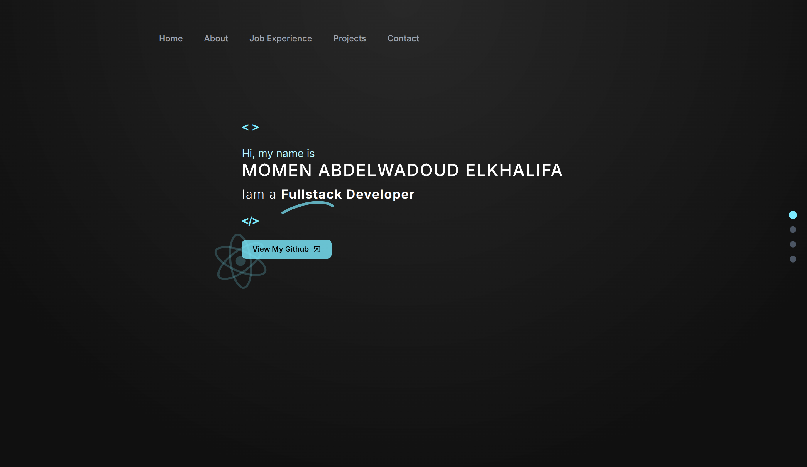

# My Personal Portfolio

## View it from [here](https://momen.codes)

## Tech Stack

1. **Frontend**: NextJS, ReactJS, Tailwind CSS
2. **UI Components**: MUI, Shadcn
3. **Languages**: TypeScript, JavaScript
4. **Animation**: Framer Motion
5. **Backend/DB**: Django, Pocketbase (Used in projects)

## How to run locally

1. Clone the repo.
2. Run `npm install` to get all the dependencies.
3. run `npx next dev` and go to `localhost:3000`.
